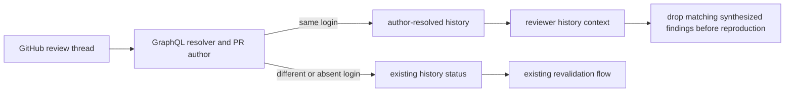

# Author-resolved PR history design

## Goal

Respect a PR author's GitHub thread resolution as an explicit disposition: do not re-raise that same concern in later review-anvil runs.

## Evidence

On `Cisco-CollabAI/nex#385`, the GraphQL API reports `aracherl_cisco` as the PR author and as `resolvedBy.login` for several review threads. The current helper fetches `reviewThread.isResolved` but not `resolvedBy`; it classifies resolved threads as ordinary prior feedback. The engine then semantically revalidates and carries those concerns forward.

## Behavior

The helper will fetch `pullRequest.author.login` and each `reviewThread.resolvedBy.login`. During root-thread history ingestion:

- If a thread is resolved by the PR author, record it as `author-resolved` with the root finding, thread URL, path, and resolution provenance.
- If a thread is unresolved, resolved by another user, or has no resolver, retain the existing status logic.
- An `author-resolved` item outranks equivalent open/reported/deferred history for the same finding, but an explicit local `suppressed` entry remains the strongest disposition.
- Before reviewer dispatch, coalesce equivalent history records deterministically: `suppressed` wins, then `author-resolved`, then every other status. This prevents GraphQL connection order from allowing an open duplicate to re-raise an author-resolved concern.

Keep `author-resolved` entries, including their concise summaries, in PR REVIEW HISTORY for reviewer dispatch so reviewers can avoid rediscovering them. After reviewer output is synthesized and deduplicated, but before reproduction, remove semantic matches for `author-resolved` history items. They must not become reproduction candidates, report rows, inline comments, or approval blockers.

This deliberately differs from ordinary GitHub resolution. A reviewer or collaborator resolving a thread still means only that discussion closed; review-anvil continues to revalidate that code.

## Data flow

## Implementation boundaries

- `review-anvil-pr/scripts/pr-helper.sh`: extend the GraphQL query, history record schema, precedence rules, and post-refresh handling.
- `review-anvil/SKILL.md` and `references/reviewer-prompt.md`: add `author-resolved` to the PR-history vocabulary and require semantic suppression before reproduction.
- `review-anvil-pr/SKILL.md`: document that only PR-author resolution is an explicit no-reraise disposition.
- Tests: cover PR-author-resolved, non-author-resolved, unresolved, semantic rewording, precedence with local suppression, no inline output, and no approval downgrade.

## Risks and controls

- A resolved thread can be a reviewer action rather than an author decision. Compare resolver login exactly with the PR author login.
- Rewording can bypass literal matching. Keep the resolved entry in reviewer context, then apply the existing semantic prior-feedback matching after synthesis/dedup and before reproduction.
- Suppression can hide a material concern. Limit it to an API-authenticated author resolution of the exact GitHub root thread; do not infer it from prose.
- A later new instance at a different code boundary is still reviewable. Only semantic matches to the resolved root finding are removed.

## Acceptance criteria

1. An author-resolved root thread is never re-raised, reproduced, reported, posted inline, or used to downgrade approval.
2. A thread resolved by anyone other than the PR author retains current revalidation behavior.
3. A reworded candidate matching an author-resolved finding is removed after synthesis/dedup and before reproduction, reporting, and approval.
4. Equivalent history records are coalesced with `suppressed` > `author-resolved` > other statuses, independent of API connection order.
5. All existing PR-helper and engine regression suites pass.
